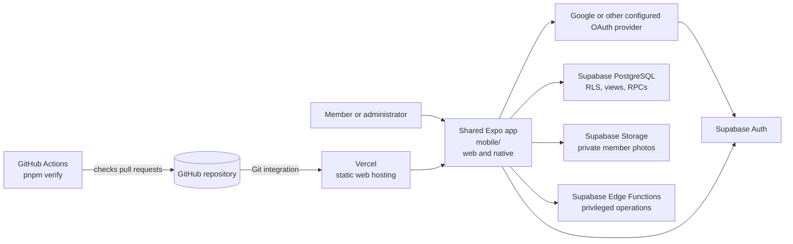

# FUBC Directory Architecture

This guide explains how the repository is connected: how the Expo application runs, where data comes from, how authorization is enforced, and how changes reach development and production.

**Audience:** repository owners and future developers.

**As of:** 2026-09-22. Repository claims are based on checked-in source and documentation. Deployed-state claims are marked separately.

## Start Here

1. [Application architecture](application.md) explains the runtime from Expo Router through features, repositories, and platform adapters.
2. [Data architecture](data.md) explains the data sources, core entities, relationships, and persistence boundaries.
3. [Security and flows](security-and-flows.md) follows authentication, authorization, representative reads and writes, and deletion.
4. [Environments and delivery](environments-and-delivery.md) explains local development, CI, Vercel, Supabase, production promotion, and rollback.
5. [Legacy and gaps](legacy-and-gaps.md) records inactive areas and unresolved facts without exploring legacy internals.

The release procedure remains authoritative for operational release steps: [Web application release](../web-app-release.md).

## System In One View

The browser application is a client-rendered Expo web export hosted by Vercel. It does not contain a server-side application. Supabase is the application backend: Auth manages identities, PostgreSQL exposes the durable domain data through policies and database functions, Storage holds private photo objects, and Edge Functions handle operations that require privileged server-side work.

## Repository Map

| Area | Purpose | Status |
| --- | --- | --- |
| `mobile/src/app/` | Expo Router routes and platform-specific root layouts | Active |
| `mobile/src/features/` | Feature UI, repositories, session, shell, and platform adapters | Active |
| `mobile/src/lib/` | Shared domain, Supabase, session, permission, and date utilities | Active |
| `mobile/supabase/migrations/` | Checked-in SQL history and backend contracts | Active reference; deployed alignment requires verification |
| `mobile/supabase/functions/` | Supabase Edge Function source | Active source; deployed status requires verification |
| `mobile/tests/` and `mobile/supabase/tests/` | Client and SQL-contract tests | Active verification |
| `docs/` | Plans, release procedures, and architecture documentation | Active documentation |
| `web/` | Previous web application area | Legacy; not explored in this guide |
| `work/` | Prototypes, mockups, and working copies | Non-production/legacy inventory; not explored in this guide |

## Evidence Legend

Every important statement in this guide should be understood using this vocabulary:

- **Code-verified:** visible in checked-in source, configuration, tests, or SQL.
- **Documented:** stated by a repository plan or runbook, but not independently proven by the implementation.
- **Live-verified:** checked against the deployed GitHub, Vercel, or Supabase configuration on the stated date.
- **Historical:** a dated observation in a setup or release document; it may no longer describe current state.
- **Unknown:** the repository does not establish the fact. The guide names the check needed rather than guessing.

## Important Vocabulary

- **Person:** a directory member and business-domain identity.
- **Account:** an application profile linked to a Supabase Auth identity; it may or may not be linked to a person.
- **Access role:** `member`, `editor`, or `admin`.
- **Leadership ministry:** a separate `pastor`, `deacon`, or empty designation used by business rules.
- **Repository:** a feature data-access boundary. It can call Supabase or use an in-memory implementation when the backend is not configured.
- **Contract version:** the database/client compatibility identifier, currently documented as `expo-directory-v3`; it is separate from the application version in `mobile/package.json`.

## Known Boundaries

- Public Supabase URL and publishable key are build-time client configuration. Service-role and secret keys must not enter the client bundle.
- Database RLS and guarded SQL functions are the backend authorization boundary. Hiding a tab in the client is only a usability measure.
- Vercel deploys the web artifact. GitHub Actions verifies code but does not deploy Vercel.
- Supabase SQL migrations and Edge Functions are a separate release lane. Backend readiness must precede a dependent production client release.
- The repository intentionally does not promise offline directory data or web notifications.
- A successful Expo export proves bundling, not physical-device behavior or App Store publication.
