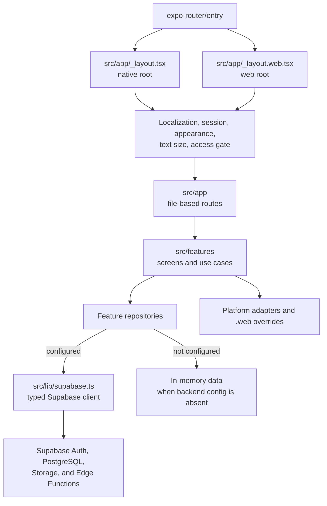
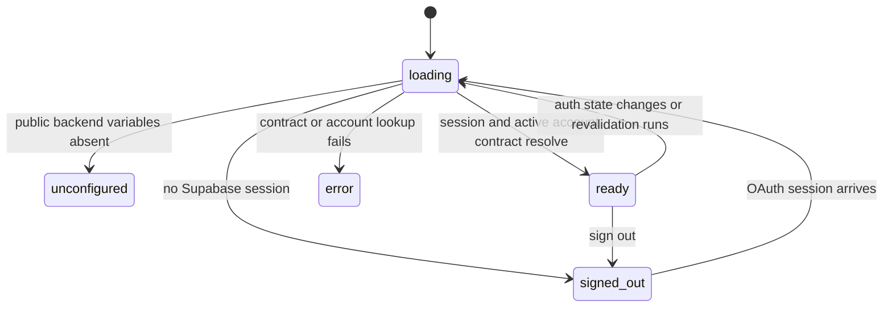

# Application Architecture

The active product is one Expo Router application in `mobile/`. It renders native and web experiences from shared routes, feature modules, domain rules, and repositories. Platform-specific files replace only the integration or shell that differs.

**Evidence:** code-verified from the application entry points and feature imports as of 2026-09-22.

## Runtime Layers

The route layer is intentionally thin. Route files normally select a feature screen; features own loading, display, and user actions; repositories own calls to Supabase or fixture-backed behavior. Shared helpers in `src/lib/` define domain types, session state, permissions, dates, phone formatting, and Supabase access.

## Root Composition

Both roots install the same state providers in this order:

1. `LocalizationProvider`
2. `SessionProvider`
3. `AppearanceProvider`
4. `TextSizeProvider`

The native root then wraps navigation in `AccessGate`. On iOS it renders Expo `NativeTabs`; other native platforms receive a stack. The Manage tab is present only when the ready account passes `canManageDirectory`.

The web root first detects OAuth parameters returned to `/` and rewrites them to `/auth/callback`. The callback route intentionally renders outside `AccessGate` and `WebAppShell` so it can finish the PKCE exchange. All other routes are gated and rendered inside the responsive web shell.

These providers are application state and presentation boundaries, not backend authorization. Database RLS, guarded SQL functions, and privileged Edge Functions remain authoritative.

## Route And Feature Map

| Route area | User-facing responsibility | Main feature/data boundary |
| --- | --- | --- |
| `(directory)/` | Search active directory members and open profiles | `features/directory/directory-repository.ts`, `features/members/` |
| `groups/` | List groups, members, responsible deacons, birthdays, and birthday settings | `features/groups/` |
| `visitation/` | List, create, edit, respond to, view, and transition visits | `features/visitation/` |
| `schedule/` | Display deacon duty periods | `features/duty/duty-repository.ts` |
| `manage/` | Manage accounts, people, ministries, groups, and duty schedules | `features/manage/management-repository.ts` plus deletion helpers |
| `account/delete` | Delete the signed-in account | `features/account/account-deletion.ts` |
| `auth/callback` | Complete browser OAuth and restore the intended route | `features/session/browser-auth.ts`, `web-oauth.ts` |
| `menu` | Account actions, locale, appearance, and text size | session, localization, appearance, and accessibility features |

The route tree is a UI map, not an access-control list. Features still call client permission helpers for understandable UX, and the backend must independently authorize every protected operation.

## Session Lifecycle

`SessionProvider` exposes the external session store maintained by `src/lib/session.ts`. The conceptual lifecycle is:

When configured, startup creates a Supabase client and subscribes to Auth changes. Session revalidation checks the backend compatibility contract and loads `current_account()`. `AccessGate` then distinguishes signed-out, pending, denied/revoked, failure, and ready states. Authentication proves the external identity; the account row determines application status, role, person link, and leadership designation.

## Repository Selection

`src/lib/supabase.ts` considers the backend configured when a Supabase URL and public publishable/anonymous key are both present. Feature data access then follows one of two patterns:

- Groups, member profiles, visitation, duty, and management export a Supabase or InMemory implementation selected at module load.
- Directory and a few preference/count helpers branch inside individual functions.

The in-memory path is demonstration and local-development data. It is not an offline cache. Once backend variables are configured, a failed Supabase query surfaces as an error; the application does not silently replace live data with fixtures.

| Repository | Principal live contracts |
| --- | --- |
| Directory | `directory_active_members()`, `directory_visible_visit_count()` |
| Member profile | `people`, `deacon_groups`, `member_profile_details()`, ministries and leadership projections |
| Groups | group/person tables, `group_birthdays()`, notification preference RPCs, summary counts |
| Visitation | visit/person projections and visit save, respond, view, and transition RPCs |
| Duty | `deacon_duty_periods`, schedule generation, reassignment |
| Management | people, ministries, groups, account RPCs, private photo storage, member/account deletion functions |

See [Data architecture](data.md) for ownership and relationships and [Security and flows](security-and-flows.md) for authorization boundaries.

## Native And Web Boundary

| Concern | Native behavior | Web behavior |
| --- | --- | --- |
| Root navigation | iOS native tabs or stack | `WebAppShell` around a stack |
| Auth persistence | Expo SecureStore adapter | Supabase browser storage |
| OAuth return | Native browser/deep-link integration | Full-page redirect and `/auth/callback` PKCE exchange |
| Auth token refresh | Starts/stops with React Native `AppState` | Supabase browser lifecycle |
| Date/time controls | Native implementation | `.web` browser inputs |
| Photos | Native picker integration | Browser file-input integration |
| Sharing | Native share surface | Browser clipboard/fallback behavior |
| Notifications | Native adapter and permissions | No web delivery promise |

Shared code includes route identities, feature use cases, repositories, permissions, localization, appearance, and most UI. Files ending in `.web.tsx` or `.web.ts` replace only browser-specific behavior through platform resolution.

## Supporting Modules

- `features/localization/` supplies English and Ukrainian copy.
- `features/appearance/` stores and applies system/light/dark preferences.
- `features/accessibility/` supplies scaled text components and text-size state.
- `features/forms/` contains reusable form and platform date/time controls.
- `features/platform/` isolates notifications and browser/native integrations.
- `features/shell/` owns the responsive web navigation shell and install help.
- `src/lib/domain.ts` describes shared public domain shapes; `src/lib/database.ts` describes the Supabase-facing TypeScript contract.

## Source Anchors

- `mobile/package.json`
- `mobile/src/app/_layout.tsx`
- `mobile/src/app/_layout.web.tsx`
- `mobile/src/app/auth/callback.tsx`
- `mobile/src/features/session/SessionProvider.tsx`
- `mobile/src/features/session/AccessGate.tsx`
- `mobile/src/lib/session.ts`
- `mobile/src/lib/session-revalidation.ts`
- `mobile/src/lib/supabase.ts`
- Repository files listed in the table above