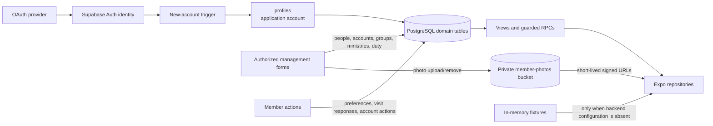
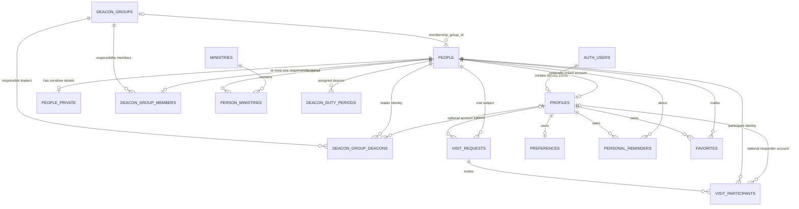

# Data Architecture

Supabase is the durable backend when public backend configuration is present. PostgreSQL stores application records, Supabase Auth stores login identities, and a private Storage bucket stores member-photo objects. SQL functions and views shape most protected reads and writes.

**Evidence:** code-verified from `src/lib/database.ts`, repository calls, and the ordered migrations. Whether every checked-in migration matches the hosted catalog remains a live-verification item.

## Where Data Comes From

There are four practical ingress paths:

- OAuth creates a Supabase Auth identity; a database trigger creates a pending `profiles` row.
- Authorized management screens create and change people, groups, ministries, account approvals, and duty schedules through guarded RPCs or approved table operations.
- Signed-in users create or respond to visits and change account-owned preferences through feature repositories.
- `supabase/seed.sql` contains repeatable fictional staging data, but its contract guard is historical and must be reviewed before use. It is not an automatic production import.

The repository does not establish the historical source of current live member records. That remains unknown unless a separate, approved operational record identifies an import or manual-entry process.

## Core Relationships

The diagram emphasizes business identity. Some operational support relationships are omitted for readability and described below.

## Person, Account, And Ministry

These concepts are related but not interchangeable:

- A **person** is a member-directory record. A person can exist without ever signing in.
- An **Auth user** is an identity managed by Supabase Auth.
- A **profile/account** is the application's row for that Auth identity. Its primary key is the Auth user ID.
- `profiles.person_id` optionally links one account to one active person. The database enforces that a person cannot be linked to multiple profiles.
- `status` controls whether an account is approved: `pending`, `active`, `denied`, or `revoked`.
- `role` controls administrative access: `member`, `editor`, or `admin`.
- Leadership is derived from a person's protected Pastor or Deacon ministry assignment. It is separate from access role.

This separation permits directory members without accounts and login accounts awaiting approval. It also lets a person's ministry remain meaningful even when no active account exists. Some actions, such as responding to an invitation, still require an account linked to that person.

## Entity Dictionary

| Entity | Meaning and important relationships | Principal writer/lifecycle |
| --- | --- | --- |
| `auth.users` | External login identity; outside the public application schema | Supabase Auth and privileged deletion functions |
| `profiles` | Application account, approval status, role, optional unique person link, revision | Signup trigger creates pending row; admins update through `update_account()` |
| `people` | Directory identity, contact fields, photo path, membership group, archive state, revision | Editors/admins through `save_person()`; archive or privileged permanent deletion |
| `people_private` | Birth date, address, marital/orphan status, private notes | Guarded projections/RPCs; direct client access is deliberately restricted |
| `ministries` | Named ministry, localized name, optional protected system key, archive state | Editors/admins through `save_ministry()` |
| `person_ministries` | Many-to-many person assignments; Pastor and Deacon are mutually exclusive protected ministries | Maintained with person management; triggers synchronize linked account designation |
| `deacon_groups` | Membership or responsibility group with archive state and revision | Editors/admins through `save_group()` or `delete_group()` |
| `deacon_group_members` | Person membership in a responsibility group; person uniqueness limits each to one | Group management RPC |
| `deacon_group_deacons` | Up to two responsible deacon people per group, with optional account compatibility link | Group management RPC |
| `visit_requests` | Planned visit: planner account, person being visited, schedule/location/notes, state, revision, submission ID | Active Pastor/Deacon planner through visit RPCs |
| `visit_participants` | Invited Pastor/Deacon person, optional linked account, response and viewed revision | Created by planner; linked participant responds through RPC |
| `deacon_duty_periods` | One deacon person assigned to each generated Sunday/weekend, with revision | Editors/admins through generation or reassignment RPCs |
| `favorites` | Account-owned person bookmarks | Owning account; present in schema contract but no current route is documented here |
| `personal_reminders` | Account-owned reminder about a person | Owning account; present in schema contract but no current route is documented here |
| `preferences` | Account locale, appearance, and notification preference | Owning account; appearance currently reads/writes this table |
| `device_tokens` | Account-owned iOS push token and invalidation state | Native notification integration/worker boundary |
| `group_birthday_notification_preferences` | Per-account setting for a responsibility group | Authorized responsible deacon through guarded RPCs |
| `audit_events` | Append-oriented actor/action/entity/metadata record | Guarded database functions |
| `visit_notification_events` | Deduplicated delivery queue state for visit changes | Database queue helper and an environment-specific worker |
| `account_deletion_requests` | Server-side account deletion orchestration state | Account deletion contract/worker boundary |

The final two support tables are defined in SQL but intentionally absent from the client-facing `Database` table map because normal client repositories do not manipulate them directly.

## Groups Have Two Meanings

`deacon_groups.kind` separates two relationship models:

- A **membership group** is referenced directly by `people.membership_group_id`.
- A **responsibility group** uses `deacon_group_members` for members and `deacon_group_deacons` for responsible leaders.

These links should not be merged conceptually. A person's congregational membership group and a deacon's care responsibility are different assignments.

## Visits Use Person Identity

A visit points to the person being visited. The planner is an authenticated profile, while each additional participant is identified durably by `person_id`; `account_id` is optional and can be filled when that person has an active linked account.

`submission_id` and an advisory lock make repeated create submissions idempotent for the planner. `revision` implements optimistic concurrency for edits, responses, views, and transitions. The planner is implicitly attending and is not duplicated in `visit_participants`.

## Photos

`people.photo_path` stores an object path, not a public image URL. Photo bytes live in the private `member-photos` Storage bucket. Reads call `createSignedUrls` with a five-minute lifetime; management upload/removal uses the same bucket. A leaked path alone is therefore not intended to grant access.

Permanent member deletion crosses PostgreSQL, Auth, and Storage boundaries. See [Security and flows](security-and-flows.md) for why that operation uses an Edge Function.

## Projections And Commands

| Contract type | Representative contracts | Purpose |
| --- | --- | --- |
| Session projection | `mobile_contract_version()`, `current_account()` | Check compatibility and load the active account |
| Directory projection | `directory_active_members()`, `member_profile_details()` | Return approved fields without opening sensitive tables |
| Leadership projections | `ministry_accounts`, `person_leadership_ministries` | Resolve linked accounts and person ministries |
| Group projections | `group_birthdays()`, `group_summary_counts()` | Return authorization-filtered aggregate/sensitive data |
| Management commands | `save_person()`, `save_ministry()`, `save_group()`, `update_account()` | Validate, authorize, audit, and update related rows |
| Visit commands | `save_visit()`, `respond_to_visit()`, `transition_visit()`, `mark_visit_viewed()` | Enforce participant and revision rules |
| Duty commands | `generate_duty_schedule()`, `reassign_duty_period()` | Validate deacons and manage rotations |
| Privileged functions | `delete-account`, `delete-member` | Coordinate operations requiring server credentials |

## Schema Sources Of Truth

No single repository file proves the hosted schema:

1. Ordered migrations describe intended evolution. The initial migration is explicitly a blank-database baseline, not evidence that it was applied to the hosted project.
2. `src/lib/database.ts` describes the client contract maintained by the application. It is not a complete catalog of server-only support tables.
3. Repositories and tests show which contracts the current client expects.
4. The hosted Supabase catalog and migration history are required to prove deployed alignment.

The client expects the documented compatibility value `expo-directory-v3`. Application SemVer is separate and does not imply a schema version.

## Data Sensitivity

- Public client configuration identifies the Supabase project but grants only policy-controlled access.
- Names, contact details, visits, care indicators, birthdays, addresses, photos, and login metadata are private church data even when a policy permits an authenticated user to read a projection.
- `people_private` is not a general client-readable table. Sensitive values are exposed only through narrowly authorized functions.
- Service-role credentials belong only in privileged server environments, never in Expo variables or generated web assets.
- Architecture documentation must use invented examples and must not copy live member rows, tokens, photo objects, or account email addresses.

## Source Anchors

- `mobile/src/lib/database.ts`
- `mobile/src/lib/domain.ts`
- `mobile/src/lib/repository-helpers.ts`
- `mobile/src/features/directory/directory-repository.ts`
- `mobile/src/features/members/SupabaseMemberProfileRepository.ts`
- `mobile/src/features/groups/SupabaseGroupsRepository.ts`
- `mobile/src/features/visitation/SupabaseVisitationRepository.ts`
- `mobile/src/features/duty/duty-repository.ts`
- `mobile/src/features/manage/management-repository.ts`
- `mobile/supabase/migrations/`
- `mobile/supabase/seed.sql`