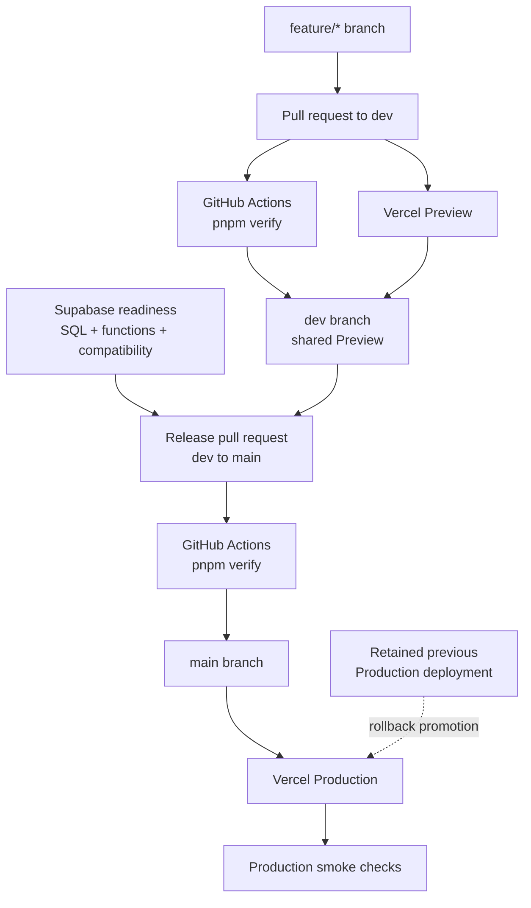

# Environments And Delivery

The application has one source tree but several execution contexts. “Development” can mean an Expo process on a developer machine, a locally served production export, a Vercel Preview built from a branch, or a backend project selected by environment variables. Those are separate choices.

**Evidence:** commands and artifacts are code-verified; release behavior is documented unless explicitly marked live-verified. No hosted settings were changed during this discovery.

## Environment Matrix

| Context | Code/artifact | Start or build path | Backend target | Verification status |
| --- | --- | --- | --- | --- |
| Expo local development | Current working tree through Metro | `pnpm web`, `pnpm ios`, `pnpm android`, or `pnpm start:phone` | Whatever public Supabase variables are loaded; absent variables enable demonstration data | Code-verified |
| Local exported-web preview | Static `mobile/dist/` export | `pnpm build:web`, then `pnpm serve:web` at `127.0.0.1:4173` | Required configured HTTPS Supabase project | Code-verified |
| Feature branch Preview | Vercel-generated static export | Git integration is intended to run the configured install/build commands | Vercel Preview variable scope | Documented; live mapping unverified |
| Shared `dev` Preview | Merge result of reviewed feature work | Intended Vercel branch deployment | Prefer isolated non-production Supabase project | Documented; remote branch and backend isolation unverified |
| Web Production | `main` static export | Vercel production deployment after merge to `main` | Vercel Production variable scope | Documented; live settings unverified |
| Native development | Expo bundle in simulator/device tooling | Expo start commands | Loaded public Supabase project plus native callback configuration | Code/documented; device behavior not established here |
| Native store distribution | Signed native artifact | No checked-in release pipeline established by this guide | Production backend and provider configuration would be required | Unestablished |

Preview and Production can point to the same Supabase project if their variable scopes are configured that way. A Vercel Preview is not evidence of backend isolation.

## Local Setup

From `mobile/`, the repository pins Node `24.x` and pnpm `12.4.1`:

```powershell
corepack enable
pnpm install --frozen-lockfile
pnpm web
```

Public backend configuration uses:

- `EXPO_PUBLIC_SUPABASE_URL`
- `EXPO_PUBLIC_SUPABASE_PUBLISHABLE_KEY`, with legacy `EXPO_PUBLIC_SUPABASE_ANON_KEY` fallback in the client
- `EXPO_PUBLIC_ENABLE_APPLE_AUTH` when Apple sign-in is intentionally enabled

Local values belong in an ignored environment file. There is currently no checked-in `.env.example`, despite an existing release-document reference to one. Never place a service-role or `sb_secret_` key in an `EXPO_PUBLIC_*` variable.

Useful checks:

```powershell
pnpm verify
pnpm build:web
pnpm serve:web
```

`pnpm verify` runs TypeScript and the configured client/domain/SQL-contract tests. It does **not** run `pnpm build:web`; both are required by the repository delivery instructions. The SQL tests use a local PGlite harness and do not establish hosted RLS or provider behavior.

## Web Build And Hosting

`scripts/build-web.mjs` sets production mode, loads Expo environment configuration, and rejects:

- missing Supabase URL/key;
- a non-HTTPS backend URL;
- a recognizable `sb_secret_` key; or
- a JWT whose role is `service_role`.

It then executes `expo export -p web`, producing a client-rendered static application in `dist/`.

`mobile/vercel.json` configures:

- frozen pnpm installation;
- `pnpm build:web` and `dist` output;
- no-store headers for the app shell;
- immutable caching for hashed Expo static assets;
- clickjacking, content-type, and referrer headers; and
- an `index.html` rewrite for application routes while excluding static assets.

`scripts/serve-web.mjs` approximates SPA fallback behavior locally and serves every response with `no-store`. It is a verification server, not the production host.

## Branch And Delivery Flow



GitHub Actions and Vercel Git integration react independently to repository events. The checked-in workflow runs `pnpm verify`; it contains no Vercel token or deploy command. A diagram arrow through both checks expresses required review gates, not that Actions launches Vercel.

The intended branch contract is:

1. Branch from `dev`.
2. Open a feature pull request to `dev`.
3. Require CI and inspect the branch Preview.
4. Merge to `dev` and verify the shared Preview.
5. Prepare backend changes independently and prove compatibility with both current and rollback clients.
6. Update application SemVer in `mobile/package.json` for a production batch.
7. Open a release pull request from `dev` to protected `main`.
8. Merge only after review and required checks; Vercel Git integration then creates Production.
9. Smoke-test the stable domain, OAuth callback, app shell, deep links, and critical reads.

On 2026-09-22, the local clone had no `origin/dev` remote-tracking branch. A local `dev` baseline was created at commit `ecd361f` to branch this documentation work correctly. The remote `dev` branch and its protection/rules must exist before the documented pull-request flow can operate as written.

## Frontend And Backend Are Separate Releases

Vercel deploys the web client. It does not apply SQL or deploy Supabase Edge Functions.

For backend-dependent work:

1. Review the migration/function source and compatibility impact.
2. Resolve hosted migration-history status before any CLI push.
3. Apply and verify approved SQL using the established backend procedure.
4. Deploy and verify required Edge Functions separately.
5. Confirm the current production client remains compatible.
6. Only then merge the dependent client release to `main`.

`mobile/supabase/CONNECT_EXISTING_PROJECT.md` records a migration timestamp collision and historical manual SQL application. Do not run `supabase db push`, `migration repair`, or history reconciliation as an onboarding shortcut.

## Versioning

There are two version axes:

- `mobile/package.json` is the application SemVer source. `app.config.js` copies it into Expo configuration.
- `expo-directory-v3` is the client/backend compatibility contract returned by `mobile_contract_version()`.

A routine application release changes SemVer only. Change the backend contract identifier only for a coordinated client/database contract revision.

## Rollback

The web rollback procedure is to promote a retained previous Vercel Production deployment, verify the stable domain and authentication flow, and then make repository history agree through a normal fix or revert PR. Do not rebuild an old commit as an untracked deployment.

Rollback is safe only if the live backend remains compatible with the previous client. Additive SQL does not automatically guarantee semantic compatibility, and there is no cross-service rollback transaction for migrations, Auth, Storage, and Edge Functions.

## Live Verification Status

No authenticated GitHub, Vercel, or Supabase CLI was available during this documentation pass, and no browser dashboard was shared for inspection. The following remain unverified:

- remote `dev` existence after feature work is published, default branch, branch protection/rulesets, and required check identity;
- Vercel root directory, production branch, Git deployment associations, domains, and variable scope-to-project mapping;
- Supabase hosted migration history, exact catalog/RLS alignment, deployed Edge Function versions, provider/callback settings, bucket policies, and notification worker/job state;
- whether Preview and Production use distinct Supabase projects;
- signed native distribution, App Store configuration, and physical-device behavior.

Repository files and prior dated notes are not substitutes for these live checks.

## Canonical Runbook

[Web application release and deployment](../web-app-release.md) remains the operational release and rollback procedure. This chapter explains architecture and evidence; update the runbook when verified operational steps change.

## Source Anchors

- `.github/workflows/ci.yml`
- `mobile/package.json`
- `mobile/app.config.js`
- `mobile/scripts/build-web.mjs`
- `mobile/scripts/serve-web.mjs`
- `mobile/vercel.json`
- `mobile/supabase/CONNECT_EXISTING_PROJECT.md`
- `docs/web-app-release.md`