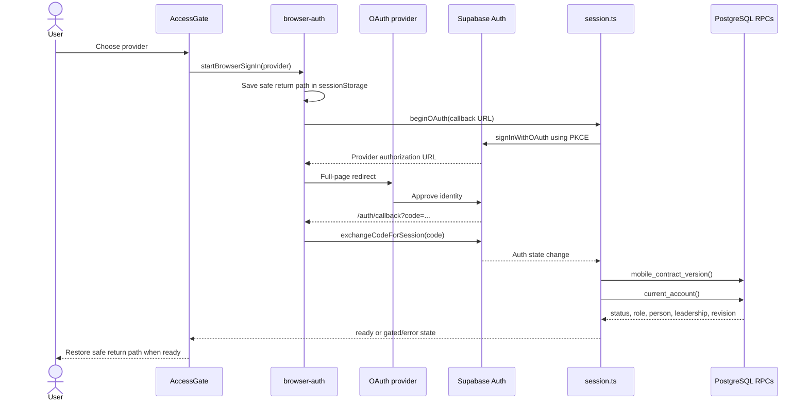
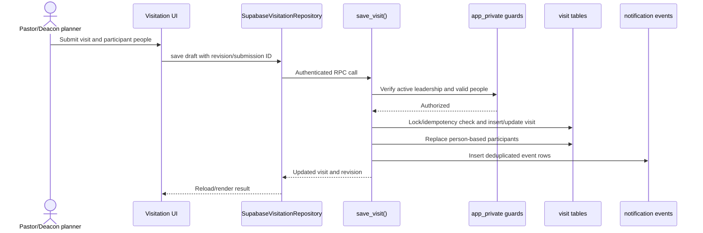

# Security And Representative Flows

Security is layered. The client hides unavailable actions and performs early checks for understandable UX, but Supabase Auth, PostgreSQL RLS, guarded SQL functions, and privileged Edge Functions make the authoritative decisions.

**Evidence:** code-verified from session, permission, migration, repository, and Edge Function source. Provider and deployed policy settings still require live verification.

## Trust Boundaries

| Boundary | What crosses it | Enforcement |
| --- | --- | --- |
| OAuth provider to Supabase Auth | Authorization code or identity token | Provider configuration, PKCE, allowed callback URLs |
| Expo client to Supabase | Public project URL/key plus user access token | Auth token validation, RLS, grants, guarded functions |
| Client UI to feature repository | Account state, input, expected revision | Client permissions and validation for UX |
| Edge Function to Supabase services | Service-role operations after caller verification | Function code must authenticate and authorize before privileged calls |
| PostgreSQL to Storage/Auth | No shared transaction across services | Explicit orchestration and retry behavior |

The publishable key is not a secret and does not bypass policies. The service-role key does bypass normal client restrictions and exists only in the Edge Function environment.

## Capability Model

An account must first be `active`. Role and leadership ministry then grant independent capabilities.

| Capability | Active member | Editor | Admin | Pastor/Deacon ministry |
| --- | --- | --- | --- | --- |
| Read directory and ordinary group data | Yes | Yes | Yes | Yes, if account is active |
| Manage people, ministries, groups, and duty | No | Yes | Yes | Not by ministry alone |
| Manage accounts | No | No | Yes | Not by ministry alone |
| Permanently delete a member | No | No | Yes | Not by ministry alone |
| Plan visits | No | Only if also Pastor/Deacon | Only if also Pastor/Deacon | Yes |
| Read a visit | No | No role override | No role override | Planner or invited participant only |
| Respond to a visit | No | No role override | No role override | Invited participant with linked account |
| Read responsibility-group birthdays | No | No role override | No role override | Responsible Deacon only |

`pending`, `denied`, and `revoked` accounts do not gain capabilities from role or ministry. Client predicates in `src/lib/permissions.ts` mirror the expected behavior, while `app_private.active()`, `editor()`, `admin()`, leadership helpers, RLS, and security-definer functions enforce it in PostgreSQL.

## Browser OAuth And Session Establishment

Important failure behavior:

- Return paths are normalized to local safe routes; external callback destinations are rejected.
- Callback completion deduplicates the same PKCE code across remounts.
- A missing or incompatible `expo-directory-v3` contract becomes a connection-update error before account data is accepted.
- An Auth session without a profile becomes an unavailable-account error.
- A valid Auth identity can still be pending, denied, or revoked at the application layer.
- During revalidation of the same identity, the current ready screen can remain mounted; stale asynchronous results are discarded by generation checks.

Native sign-in uses native identity/browser integrations but converges on the same Supabase session and `current_account()` resolution.

## Directory Read And Private Photos

1. The directory screen calls `directory_active_members()` through the directory repository.
2. The guarded function checks for an active account and returns only its approved projection.
3. Photo paths are grouped and sent to the private `member-photos` bucket.
4. Storage returns signed URLs valid for 300 seconds.
5. The UI renders the result; the underlying object is not made public.

A member profile combines several authorized sources: `people`, group/ministry projections, and `member_profile_details()`. The function is the boundary for sensitive profile fields; direct access to `people_private` is not the intended client path.

## Visit Creation And Response

For a response, `respond_to_visit()` resolves the caller's linked person and verifies that person is invited. It rejects a stale revision, closed/archived visit, non-participant, or invalid response. A successful response updates the participant, increments the visit revision, audits the action, and queues an event.

Queue rows do not prove that a push was delivered. Delivery requires a separately deployed worker/scheduler, current device tokens, and runtime authorization rechecks.

## Optimistic Concurrency And Idempotency

Mutable records carry integer revisions. Update RPCs compare the caller's expected revision and increment on success. A mismatch produces a conflict requiring reload and review; it should not be automatically overwritten.

New visits additionally carry a `submission_id`. The database takes an advisory transaction lock and returns an existing visit for the same planner/submission pair, making retries after a lost response safer.

## Account Deletion

The account-deletion route invokes the `delete-account` Edge Function with the current access token and a typed-name confirmation.

1. The function validates the Supabase user from the bearer token.
2. A user may delete their own account; deleting another account requires an active admin.
3. The final active administrator cannot be deleted.
4. For supported self-deletion input, Google token revocation is attempted and recorded, but failure does not block account deletion.
5. An audit event preserves the action and the directory-person reference.
6. Admin Auth deletes the Auth user; the profile follows its Auth foreign-key lifecycle while the directory person remains.

This is account deletion, not directory-member deletion. The current function performs deletion directly; older documentation that describes only a queued request is historical.

## Permanent Member Deletion

The `delete-member` Edge Function is restricted to active administrators and requires a current person revision plus exact-name confirmation.

1. Authenticate the caller and authorize the admin role.
2. Validate the person, revision, confirmation, self-delete prohibition, and final-admin protection.
3. Delete a linked Auth identity and profile when present.
4. Remove the private photo object when present.
5. Call `delete_member_record()` as the authenticated caller to remove the person and linked domain records transactionally inside PostgreSQL.

The function treats an already-missing person as a successful retry. However, Auth, Storage, and PostgreSQL do not share one transaction. A later failure can follow an earlier successful deletion, so the returned structured error and audit/operational evidence matter. Retrying is designed to be safer, but partial-failure recovery still requires an operational runbook.

## Failure Boundaries

| Failure | Visible consequence | Correct interpretation |
| --- | --- | --- |
| Backend variables absent | Demonstration/unconfigured mode | No live persistence is active |
| Configured Supabase query fails | Feature error | Do not fall back silently to fixtures |
| Contract version mismatch | Session connection-update error | Client and backend are incompatible |
| Account not active | Access gate blocks application | Authentication succeeded; authorization did not |
| Revision conflict | Mutation rejected | Reload before deciding whether to retry |
| Missing deployed RPC/function | Repository action fails | Checked-in source is ahead of backend deployment |
| Queue row without worker | No proven delivery | Persistence is not notification delivery |
| Cross-service deletion failure | Possible partial cleanup | Inspect structured result and service state before repair |

## Source Anchors

- `mobile/src/lib/permissions.ts`
- `mobile/src/lib/session.ts`
- `mobile/src/lib/session-revalidation.ts`
- `mobile/src/features/session/browser-auth.ts`
- `mobile/src/features/session/web-oauth.ts`
- `mobile/src/lib/repository-helpers.ts`
- `mobile/src/features/visitation/SupabaseVisitationRepository.ts`
- `mobile/src/features/account/account-deletion.ts`
- `mobile/src/features/manage/member-deletion.ts`
- `mobile/supabase/functions/delete-account/index.ts`
- `mobile/supabase/functions/delete-member/index.ts`
- `mobile/supabase/migrations/`